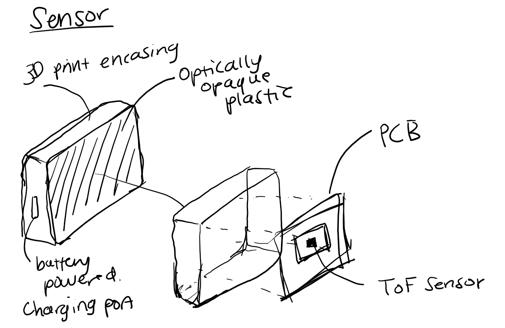
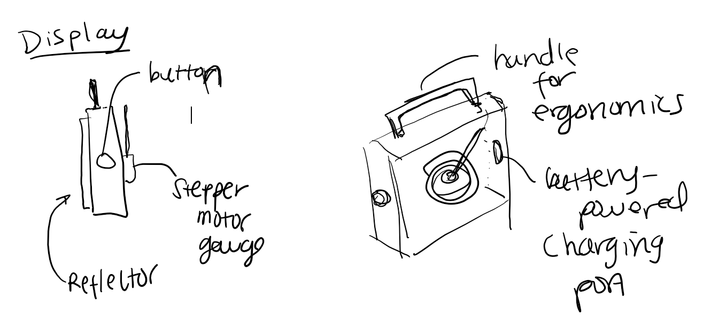

# System Architecture with Diagram 

## Two-piece measuring tape- Digital Protractor 
### System Overview 
A two-piece set of blocks set apart to measure the space in between them. Essentially measuring a distance from point A to point B. One block is a stationary reference point while the other provides a measurement reading for the user.  

[insert sketch here]

## Sensor Device - Sensor Block
The sensor will be the piece to sit stationary via battery powered. It uses a Time of Flight laser distance sensor to detect how long it takes for the light to reflect back to the sensor from the display device. Online research suggests the Kalman Filter to remove "jitter" from laser data-- implement via process noise and measurement noise parameters. 

## Display Device - Device Block
The display device via battery powered, has a reflector that the sensors' light emitter will bounce off of. A button has two actions- one-click to start the measurement and one-click to "tare" or hold the reading. The stepper maps the distance to a range, turning the sensors measurements into physical dial gauge readings. 

## Communication & System Diagram 
The Sensor Block is stationary. The Device Block gets moved to desired location ensuring sufficient visibility between sensor and reflector. Device block triggers measurement sequence, sensor emits pulse of laser light, light bounces off reflector and comes back to sensor, calculation for "time of flight" processes and sent back to Display Block. 

